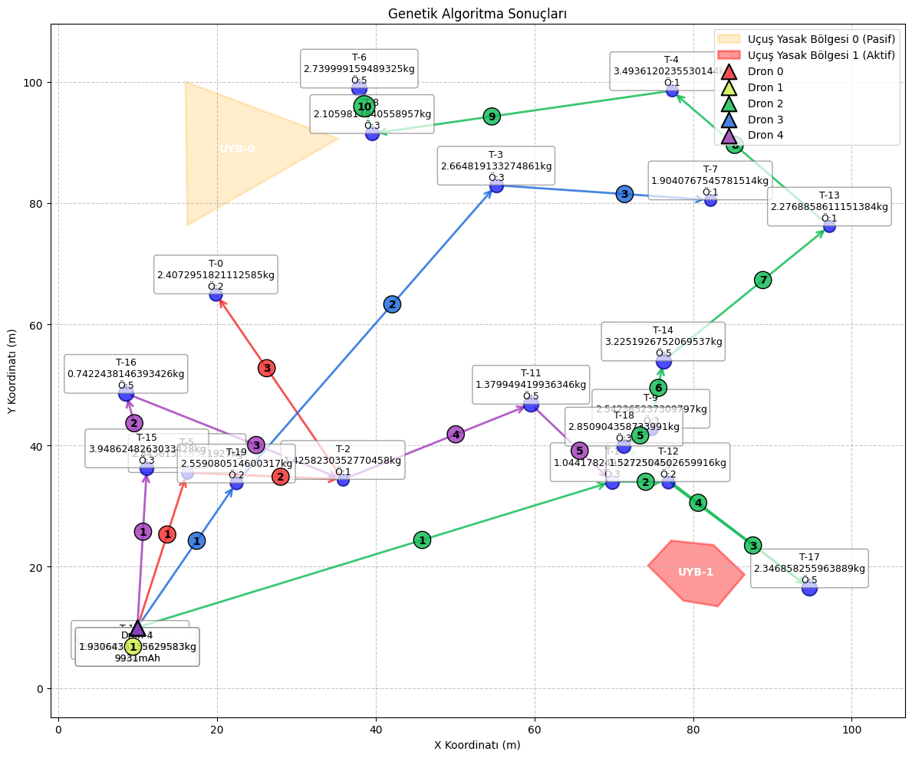
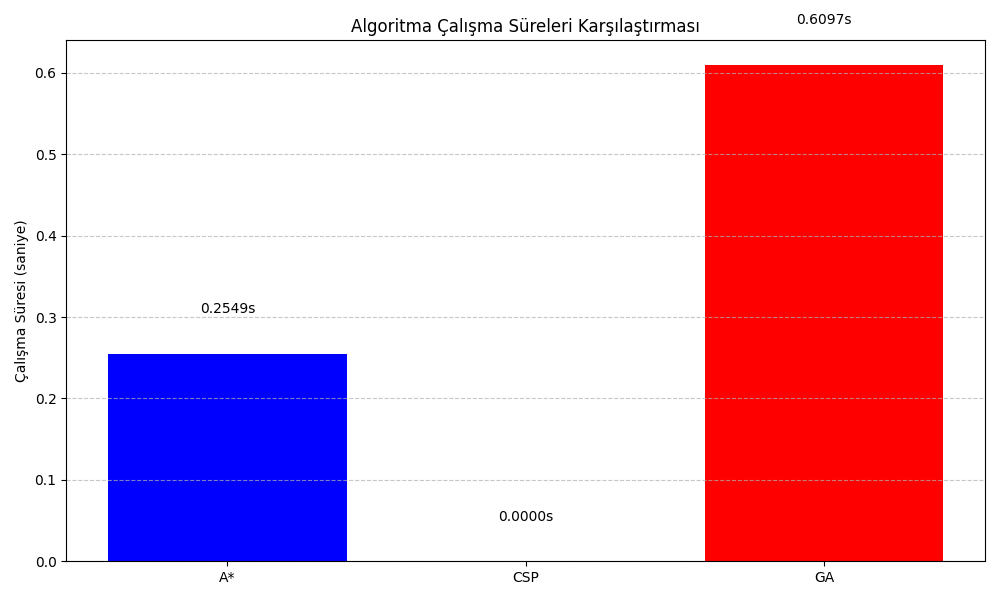

# Drone Filo Optimizasyonu

Bu proje, enerji limitleri ve uçuş yasağı bölgeleri (no-fly zone) gibi dinamik kısıtlar altında çalışan drone'lar için en uygun teslimat rotalarının belirlenmesini sağlayan bir algoritma tasarımını içermektedir.

## Proje Özeti

Teslimat hizmeti sunan bir lojistik firması için farklı ağırlık ve öncelik seviyelerine sahip paketleri, çok sayıda drone ile kısa sürede ve verimli bir şekilde ulaştırmak için bir çözüm sunulmaktadır. Projede üç farklı algoritma yaklaşımı uygulanmıştır:

1. **A* Algoritması**: Teslimat noktaları arasında en uygun rotaları bulan algoritma
2. **Kısıt Tatmin Problemi (CSP)**: Drone'ların aynı anda tek paket taşıması ve uçuşa yasak bölgeleri ihlal etmemesi gibi kısıtları modelleyen algoritma
3. **Genetik Algoritma**: Çoklu drone ve teslimat noktaları için global optimizasyon sağlayan algoritma

## Geliştirme Ortamı

- Python 3.11
- Gerekli kütüphaneler: matplotlib, numpy

## Kurulum

1. Projeyi indirin veya klonlayın:
```
git clone https://github.com/kullanici/drone-fleet-optimization.git
cd drone-fleet-optimization
```

2. Gerekli kütüphaneleri yükleyin:
```
pip install -r requirements.txt
```

## Kullanım

### Test Senaryolarını Çalıştırma

Önceden tanımlanmış test senaryolarını çalıştırmak için:

```
python main.py --test
```

Bu komut, iki farklı test senaryosunu çalıştırır ve sonuçları `cikti` dizinine kaydeder.

### Yeni Bir Senaryo Üretme

Rastgele bir senaryo üretmek için:

```
python main.py --uret
```

Üretilen senaryoyu görselleştirmek için:

```
python main.py --uret --gorselleştir
```

### Belirli Bir Senaryoyu Çözme

Belirli bir senaryo dosyasını yükleyip çözmek için:

```
python main.py --senaryo <senaryo_dosyası> --coz <algoritma>
```

Burada `<algoritma>` şunlardan biri olabilir: `a_yildiz`, `kisit`, `genetik` veya `hepsi`.

Örnek:
```
python main.py --senaryo cikti/senaryo1.txt --coz hepsi --gorselleştir
```

## Proje Yapısı

- `models.py`: Temel veri yapılarını (Drone, TeslimatNoktasi, UcusYasakBolgesi) içerir
- `astar.py`: A* algoritması implementasyonu
- `csp.py`: Kısıt Tatmin Problemi (CSP) implementasyonu
- `genetic.py`: Genetik Algoritma implementasyonu
- `visualization.py`: Görselleştirme modülü
- `data_generator.py`: Örnek veri üreteci
- `test_scenarios.py`: Test senaryoları
- `main.py`: Ana program

## Örnek Görselleştirme



## Performans

Algoritmaların performans karşılaştırması:

- A* algoritması: Tek drone için optimal rota bulma
- Kısıt Çözücü algoritması: Çoklu drone için kısıtları sağlayan çözüm bulma
- Genetik Algoritma: Çoklu drone için global optimizasyon

Senaryo 1 (5 drone, 20 teslimat, 2 uçuş yasak bölgesi) için karşılaştırma:


